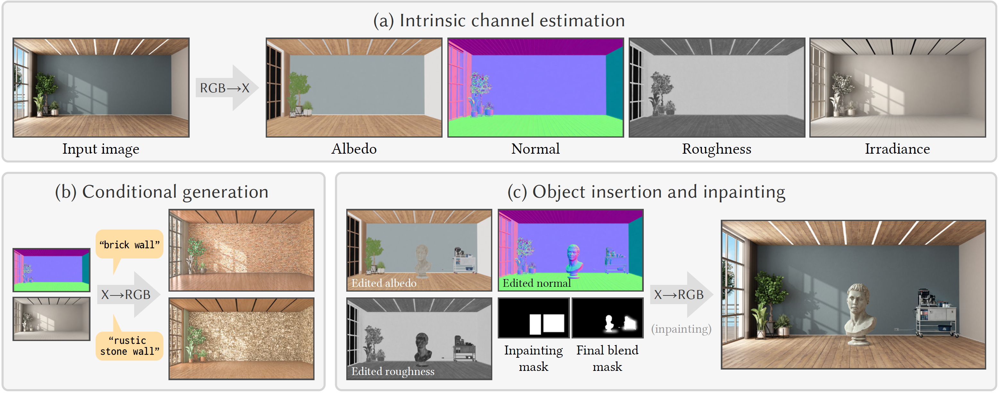

<h1 align="center"> RGB↔X: Image Decomposition and Synthesis Using Material- and Lighting-aware Diffusion Models </h1>

<p align="center"><a href="https://zheng95z.github.io/" target="_blank">Zheng Zeng</a>, <a href="https://valentin.deschaintre.fr/" target="_blank">Valentin Deschaintre</a>, <a href="https://www.iliyan.com/" target="_blank">Iliyan Georgiev</a>, <a href="https://yannickhold.com/" target="_blank">Yannick Hold-Geoffroy</a>, <a href="https://yiweihu.netlify.app/" target="_blank">Yiwei Hu</a>, <a href="https://luanfujun.com/" target="_blank">Fujun Luan</a>, <a href="https://sites.cs.ucsb.edu/~lingqi/" target="_blank">Ling-Qi Yan</a>, <a href="http://www.miloshasan.net/" target="_blank">Miloš Hašan</a></p>

<p align="center">ACM SIGGRAPH 2024</p>

<p align="center"></p>

The three areas of realistic forward rendering, per-pixel inverse rendering, and generative image synthesis may seem like separate and unrelated sub-fields of graphics and vision. However, recent work has demonstrated improved estimation of per-pixel intrinsic channels (albedo, roughness, metallicity) based on a diffusion architecture; we call this the RGB→X problem. We further show that the reverse problem of synthesizing realistic images given intrinsic channels, X→RGB, can also be addressed in a diffusion framework.

Focusing on the image domain of interior scenes, we introduce an improved diffusion model for RGB→X, which also estimates lighting, as well as the first diffusion X→RGB model capable of synthesizing realistic images from (full or partial) intrinsic channels. Our X→RGB model explores a middle ground between traditional rendering and generative models: we can specify only certain appearance properties that should be followed, and give freedom to the model to hallucinate a plausible version of the rest.

This flexibility makes it possible to use a mix of heterogeneous training datasets, which differ in the available channels. We use multiple existing datasets and extend them with our own synthetic and real data, resulting in a model capable of extracting scene properties better than previous work and of generating highly realistic images of interior scenes.

## Structure
```
├── assets                  <- Assets used by the README.md
├── rgb2x                   <- Code for the RGB→X model
│   ├── example                 <- Example photo
│   └── model_cache             <- Model weights (automatically downloaded when running the inference script)
├── x2rgb                   <- Code for the X→RGB model
│   ├── example                 <- Example photo
│   └── model_cache             <- Model weights (automatically downloaded when running the inference script)
├── environment.yaml       <- Env file for creating conda environment
├── LICENSE
└── README.md
```

## Model Weights
You don't need to manually download the model weights. The weights will be downloaded automatically to `/rgb2x/model_cache/` and `/x2rgb/model_cache/` when you run the inference scripts.

You can manually acquire the weights by cloning the models from Hugging Face:
```bash
git-lfs install
git clone https://huggingface.co/zheng95z/x-to-rgb
git clone https://huggingface.co/zheng95z/rgb-to-x
```

## Installation
Create a conda environment using the provided `environment.yml` file.

```bash
conda env create -n rgbx -f environment.yml
conda activate rgbx
```

Note that this environment is only compatible with NVIDIA GPUs. Additionally, we recommend using a GPU with a minimum of 12GB of memory.

## Inference
When you run the inference scripts, gradio demos will be hosted on your local machine. You can access the demos by opening the URLs (shown in the terminal) in your browser.

### RGB→X
```bash
cd rgb2x
python gradio_demo_rgb2x.py
```

**Please note that the metallicity channel prediction might behave differently between the demo and the paper. This is because the demo utilizes a checkpoint that predicts roughness and metallicity separately, whereas in the paper, we used a checkpoint where the roughness and metallicity channels were combined into a single RGB image (with the blue channel set to 0). Unfortunately, the latter checkpoint was lost during the transition between computing platforms, and we apologize for the inconvenience. We plan to resolve this issue and will provide an updated demo in the near future.**

### X→RGB
```bash
cd x2rgb
python gradio_demo_x2rgb.py
```

## Acknowledgements

This implementation builds upon Hugging Face’s [Diffusers](https://github.com/huggingface/diffusers) library. We also acknowledge [Gradio](https://www.gradio.app/) for providing an easy-to-use interface that allowed us to create the inference demos for our models.
